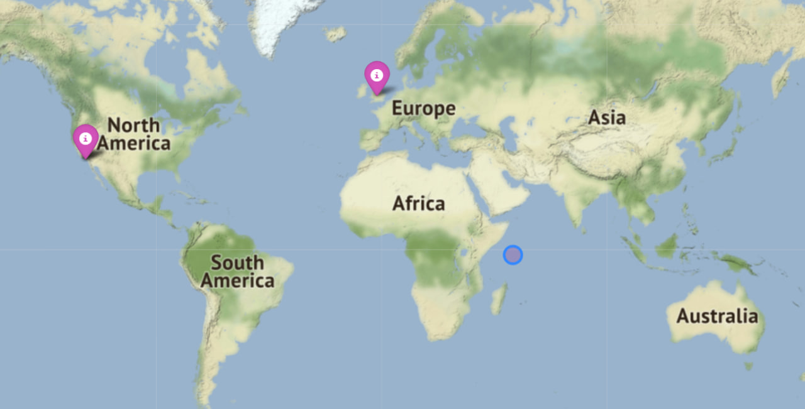

# Films Locations
read_file - зчитує файл та повертає список зі списками. Перший елемент - назва фільму наступний місце, де фільм був знятий

right_year - повертає такий самий список зі списками, але вже з фільмами які були зняти в певному році

coordinates - функція бере список зі списками і в кожен список додає ще один елемент - координати місця зйомки.

distance - функція визначає відстань між початковими координатами та координатам кожного фільму та повертає перші 10, які знаходяться найближче 

filling_map - функція створює мапу, підписує її, та ставитьна ній початкову точку(кільце), а потім місця зйомки фільмів з назвою самого фільму

main - функція дозволяє запускати програму через консоль

Карта нам показує локацію фільмів, які були зняті виключно в певному році та які знаходяться найближче до обраної точки. Наприклад буде цікаво подивитись які фільми були зняті біля вашого будинку. 


## Usage/Examples

```python
python3 films.py '1991' films.list 49.817545 24.023932
```


## Screenshots



